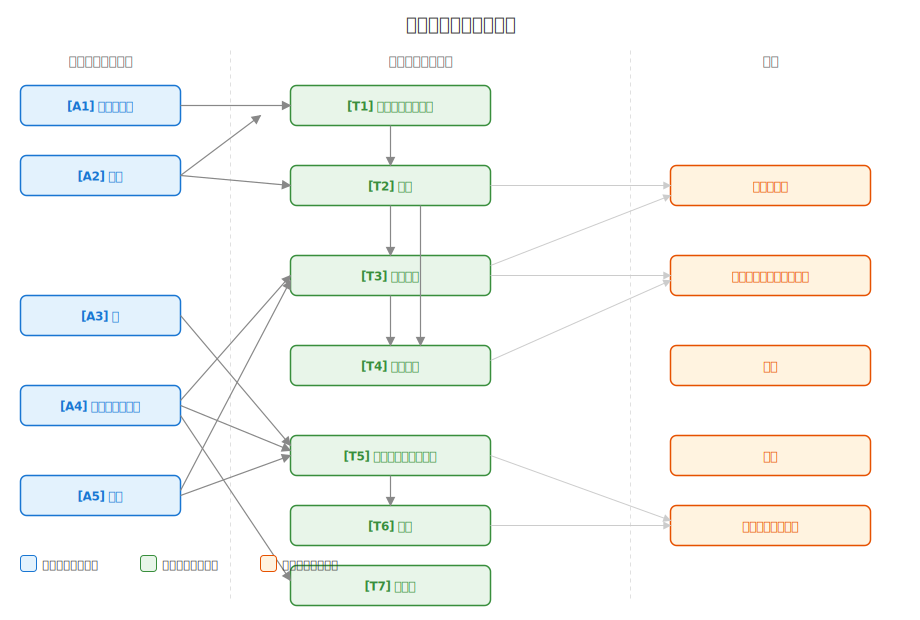

# 世界の法則 — 導出構造マップ

本プロジェクトの世界設定は、6つの基本法則（公理）から各設定要素が論理的に導出される体系として構成されている。このページでは導出構造の全体像と推奨される読み順を示す。

## 公理一覧

| ID | 公理 | 概要 |
|---|---|---|
| A1 | [現界と真界](世界の法則.md#a1-現界と真界) | 人間が存在する3次元空間（現界）と、マナが存在する異次元（真界） |
| A2 | [マナ](世界の法則.md#a2-マナ--真界の純粋エネルギー) | 真界に存在する純粋なエネルギー。あらゆる物理エネルギー・物質に変換可能 |
| A3 | [個体](世界の法則.md#a3-個体) | 現界に存在する、境界と持続性を持つ物質のまとまり。入れ子構造をとる |
| A4 | [魂](世界の法則.md#a4-魂--真界と現界をつなぐ孔) | 真界と現界をつなぐ孔。個体ごとに異なる形を持つ |
| A5 | [精神エネルギー](世界の法則.md#a5-精神エネルギー) | 思考・意思から生まれるエネルギー。波長・強さ・方向の3属性を持つ |
| A6 | [マナの変換](世界の法則.md#a6-マナの変換--現化とマナ還元) | マナと現界の物理エネルギー・物質の相互変換（現化とマナ還元）の原理 |

## 導出関係

```
基本法則（公理）                導出法則（定理）              応用
─────────────────────────────────────────────────────────────────
A1 現界と真界 ──┐
                ├─→ T1 エネルギー保存則 ──┐
A2 マナ ────────┤       (A1+A2+A6)        │
                │                         ├─→ T2 瘴気 ──────┐
A3 個体 ──┐     │                         │    (A6+T1)      │
          │     │                         │                 │
A4 魂 ──┐ │     │                         │    T3 存在強度 ←┤
        │ │     │                         │    (A5+A6+T2)   │
A5 精神 │ │     │                         │                 │
  エネ ─┼─┼─────┤                         │    T4 マナ還元 ←┘
        │ │     │                         │      (T2+T3)
A6 マナ │ │     │                         │
  の変換┤ │     │                         │
        │ │     │→ T5 魔法 ─────────→ T6 魔術（T5+術式）
        │ │        (A4+A5+A6)
        │ │
        │ │        T7 超能力（A5→他個体に作用）
```



## 定理一覧

| ID | 定理 | 導出元 | 詳細 |
|---|---|---|---|
| T1 | [エネルギー保存則](世界の法則.md#t1-エネルギー保存則) | A1 + A2 + A6 | [世界の法則](世界の法則.md) |
| T2 | [瘴気](世界の法則.md#t2-瘴気) | A6 + T1 | [世界の法則](世界の法則.md) |
| T3 | [存在強度](世界の法則.md#t3-存在強度) | A5 + A6 + T2 | [世界の法則](世界の法則.md) |
| T4 | [マナ還元](世界の法則.md#t4-マナ還元) | T2 + T3 | [世界の法則](世界の法則.md) |
| T5 | [魔法](世界の法則.md#t5-魔法現化真化) | A4 + A5 + A6 | [魔法](魔法.md) |
| T6 | [魔術](世界の法則.md#t6-魔術) | T5 + 術式 | [魔術](魔術.md) |
| T7 | [超能力](世界の法則.md#t7-超能力感応支配) | A5 → 他個体 | [超能力](超能力.md) |

## 応用ドキュメント

| ドキュメント | 主な導出元 |
|---|---|
| [遺物・アーティファクト](artifacts.md) | T3 存在強度、T4 マナ還元 |
| [ダンジョン](dungeon.md) | T2 瘴気、T3 存在強度、遺物、種子 |
| [種族](../character/種族.md) | A3 個体、A4 魂、A5 精神エネルギー、種子 |
| [年表](../history/timeline.md) | 世界の法則全般 |
| [魔法・魔術の歴史](../history/magic-history.md) | T5 魔法、T6 魔術 |

## 推奨読み順

### 体系的理解パス（全体を通して理解したい方向け）

1. [世界の法則](世界の法則.md) — 公理A1-A6、定理T1-T4を通読
2. [魔法](魔法.md) — T5の詳細
3. [魔術](魔術.md) — T6の詳細
4. [超能力](超能力.md) — T7の詳細
5. [遺物・アーティファクト](artifacts.md) — 遺物、種子、伝説の武具
6. [ダンジョン](dungeon.md) — 応用的な空間現象
7. [種族](../character/種族.md) → [年表](../history/timeline.md) → [魔法・魔術の歴史](../history/magic-history.md)

### 早引きパス（特定の概念を確認したい方向け）

- [概念索引（glossary）](../glossary.md) から概念名で検索し、出典リンクをたどる

### 物語利用者パス（物語・ゲーム・漫画に使いたい方向け）

1. このページの公理一覧・定理一覧で全体像を把握
2. [魔法](魔法.md) / [魔術](魔術.md) で戦闘・能力のルールを確認
3. [種族](../character/種族.md) でキャラクター設計の制約を確認
4. [年表](../history/timeline.md) で物語の時代背景を選択
5. 必要に応じて[世界の法則](世界の法則.md)の詳細を参照
