# 世界の法則

## はじめに

## 現界

- 人間が物理的に存在している3次元空間、宇宙全体を現界と呼ぶ
- 重力など物理法則は基本的に*著者が存在している世界*の物理法則に酷似している。
- 一方で特有の法則（マナ、精神エネルギー、魂）が存在し、この法則を利用して特定の現象を意図的に発生させることができる。（※後述）
  - その多くは現界における物理エネルギーを意図的に発生させることにより生ずるものだが、一部には現界の物理法則とは明らかに異なる現象もあり得る
  - 物理エネルギー
    - 力学的エネルギー（運動エネルギー）
    - 電磁気（電気・磁気）エネルギー
    - 熱エネルギー
    - 化学（結合・燃焼）エネルギー
    - 光・放射線エネルギー
    - 核（核分裂・核融合）エネルギー

## マナ（真界）

- マナは現界の3次元空間とは異なる次元（真界）に存在する純粋なエネルギーである
  - 純粋なエネルギーはあらゆる物理エネルギーに変換可能な、ポテンシャルという概念そのもの
- マナから物質の生成も可能である
- 物理エネルギーまたは物質を生成した場合に副産物として瘴気（※後述）が発生する
  - 生成した物理エネルギーまたは物質は瘴気と反応しやすい不安定な状態であり、生成時に発生した瘴気と反応してすぐにマナに戻ってしまうため、現界に長時間とどめておくのは難しい
- 現界から見ると3次元座標におけるエネルギの軸としてみることもできる
- 真界の中でマナに濃淡がある
  - 真界は中でマナが揺れ動いている球体ととらえることができ、さらにその球体の表面が現界の3次元座標にマッピングされているイメージ
    - 球体の表面から手を伸ばして触れるマナが多ければ
    - 付近でマナが濃い状態であれば手を伸ばして触ることのできるマナの量も多い
    - 球体の奥まで手を伸ばせるかによって扱えるマナの量も変わる（魂の大きさによる。人のレベルで劇的に変わることはまずない）
  - マナの濃淡の変化に法則性はない
    - ただし3次元空間での時間軸で見たときに、その変化は非常に緩慢であり、数千年～数万年の単位で変化がわかる程度。（もちろん例外もある）
  - マナの総量は膨大であり、惑星単位での総エネルギーとはスケールが違う
    - 一方で、ビッグバンによって大部分は現界に放出されているため、宇宙全体ではさらにスケールが違う
    - 宇宙全体のエネルギー総量 》ビッグバン以降の真界のマナの総量 》惑星単体のエネルギー総量
- 真界からマナを取り出すためには魂と精神エネルギーが関係する（※後述）
  - 真界 → 魂（真界と現界をつなぐ孔） → 精神エネルギー（触媒・共鳴） → 物理エネルギー
  - マナが極端に濃くなった場合に、魂や精神エネルギーとは関係なく現界に染み出すこともある。
    - その超大規模なものがビッグバン
- マナをマナのままで取り出すことはできず、現界に取り出した時点で何らかの物理エネルギーまたは物質に変換される
  - 方向性を与えること、変換をコントロールすることが可能

### 瘴気

- マナから物理エネルギーや物質を生成した際に発生する反物質で、現界に存在する物理エネルギーや物質と結合してマナに戻り、真界に収められる
  - マナ還元、あるいは単純に還元と呼ぶ
  - 原則としてマナを取り出した魂か、還元の触媒となった精神エネルギーの持ち主の魂を通って戻る
- 物質のような質量はない
- ビッグバンのように特定の個体の魂からマナを取り出すのではなく、真界からマナがしみだしたケースでは、還元後に真界に戻るための魂がないため、還元が起こらない。
  - その間に生成された物質やエネルギーの魔法的な励起状態がなくなり、瘴気はそのまま現界にとどまることとなる
- 瘴気は還元の方向を持った精神エネルギーやそれを発生させる固体、および魂に引き寄せられる特性がある
- 生物にとっては有毒
  - 即効性はないが、徐々に体の構成物やエネルギーが還元されるため
  - 数年触れていて影響が出てくる程度

#### マナ還元

- 瘴気と物質または物理エネルギーが結合してマナの状態に戻ること
  - マナの状態に戻るタイミングで真界に戻る
- 物質との結合しやすさがあり、「魔法的な励起状態 ÷ 存在強度」で表すことができる
- 精神エネルギーを触媒にすることで魔法的な励起状態が低い状態であっても、物質やエネルギーと結合させることができる
  - 原則として還元の優先度は魔法的な励起状態にある物質のほうが高いため、マナから物質・エネルギーを生成した際に生じた瘴気を使って、別の物質・エネルギーを還元することは困難である
- 魔法的な励起状態になければ還元は起こりにくいが、まったく起こらないわけではない

#### 魔法的な励起状態

- マナから変換された直後の物質や物理エネルギーは不安定な状態で、マナに戻りやすい状態にある。
  - これを魔法的に励起していると表現する
    - 逆は基底状態
  - 時間の経過によって励起状態から基底状態となる
  - 生成した物質・エネルギーは、数秒程しか現界にとどまらない
  - また、間接的にマナから生成された物質や物理エネルギー（マナから変換された物質や物理エネルギーが別の物質やエネルギーに変換された場合など）も同様に魔法的に励起した状態となる

#### 存在強度

- 物質・エネルギーが、精神エネルギーの影響を受けている度合いを表す
- マナと共振した物質・エネルギーは精神エネルギーが土台となっているため、精神エネルギーが強いほど存在強度は強くなる
- 精神エネルギーは特定の個体だけのものではなく、複数の個体の集合無意識のようなものも関係する
  - 例えば、万人から存在が知られる聖剣は存在強度が強い
  - 特定の個体が一時的にマナから変換した物質やエネルギーは、その個体の精神エネルギーがあったとしても上記と比べて弱い

## 魂

- 真界から現界にマナの橋渡しをする孔は個体ごとに異なる形をもって存在しており、魂と呼ばれる。
- 形とは、そこを通ったマナに与えられる方向性という意味であり、現界に顕在する時の方向性がある程度決まる
  - その魂を持つ個体もその方向性に影響され、またその度合いに強弱がある
    - 例えば、「熱い」という方向性の魂をもった個体は、平熱が高いというような個性と言えるレベルのものから、身体の発熱能力にすぐれ極寒の中での活動が可能といった明らかに常人を超えるレベルまでありうる。
      - 後者のレベルが発現することは稀で、基本はその個体としての誤差（個性）レベルの影響である。
    - 例えば、ダイヤモンドは「固い」という方向性の魂を持った個体である。
      - ダイヤモンドだから「固い」という魂を持つのか、「固い」という魂を持つのでダイヤモンドなのか、両パターンがあり得る
- 3次元的な大きさの概念もあり、マナが一度に通ることができる量が決まる。
  - 奥行きが大きいほど、真界の奥からマナを引き出せる
  - 全体が大きいほど、1度に多くのマナを引き出せる
- 個体の成長の過程で変わる可能性はほとんどない
‐ 原則として個体と1対1で結びついている
  - つながるというのは精神エネルギーを伸ばしてアクセスできるようなイメージ
- 精神エネルギーの波長が極めて近いなどの特殊な条件がそろうことで他個体の魂とつながることも可能（同調）

## 精神エネルギー

- 思考や意思（意識的／無意識的にかかわらず）によって生み出される
  - 人だけではなく、動物のようなほかの生物や、地球といった惑星の単位でも、この世界に存在する質量をもった"個体"が生み出す
    - "個体"とは視点によって異なり、大小はあるががそれぞれが生み出す（ミクロでは人間の細胞、人間そのものという単位、マクロでは地球、銀河という単位）
- マナと物理エネルギーの中間に位置する
- 精神エネルギーはマナと共鳴し、触媒の役割をすることで、真界から魂を経由してマナを現界の物理エネルギーに変換して取り出すことができる
  - この魂は原則として精神エネルギーを生み出す個体自身の魂であるが、ほかの個体の魂を経由することも不可能ではない
    - 同調と呼ぶ
    - 特定の条件を満たす必要はあり、難易度は非常に高い
      - 真界の表面上で自分の魂と相手の魂の座標が重なっている、または非常に近い（後述の精神エネルギーをが生み出される範囲内にある）
      - 相手の精神エネルギーと波長が極めて近い
- 精神エネルギーはマナ還元の触媒の役割も果たす
  - 意図して魔法的な励起状態にない物理エネルギーまたは物質と結合させることも可能
- 波長と強さと方向の3つの概念が存在する
- また、精神エネルギーはマナだけではなく、ほかの個体に影響を与えることもできる（感応・支配）

### 精神エネルギーの波長

- 精神エネルギーを生み出す"個体"によって個性があり、現界と真界の2極の間でグラデーションがある
  - このグラデーションを波長という
    - 3次元空間における波という意味ではなく、性質や相性という意味での波長に近い概念
  - 波長が同じである個体は原則として存在しない
- 個体が宇宙のルーツに近いほど、真界に近い波長の精神エネルギーを発生させる
  - 原初の宇宙誕生から時がたち、物質や生物として変化（進化）して形を変えていくことはルーツから遠ざかることであり、生み出す精神エネルギーの波長も真界から遠ざかること、すなわち現世寄りの波長となることである
    - 進化を繰り返した種であっても特異的にルーツが近い種族・個体が発生することもある（原初返り）
- 肉体の影響を強く受けるため、基本的に種族ごとに波長に傾向があり、また個体ごとの個性もある
- 精神エネルギーの波長が真界に近いほど、少しの精神エネルギーで多くのマナと共鳴できる

### 精神エネルギーの強さ

- 意思の強さが精神エネルギーの強さに直接影響する
  - 意思を持っている、すなわち知性がある個体ほど大きな精神エネルギーを生み出す
- 個体の物理的な大きさも生み出す精神エネルギーに影響する
  - 人間程度の大きさ（重さ数十～100kg程度）の差であれば影響は小さい
- 精神エネルギーの強さは共鳴できるマナの量に影響する

### 精神エネルギーの方向

- マナを現界に取り出したときにどのような物理エネルギーとして、または物質として顕在させるかは精神エネルギーの方向で決まる
- マナ還元の触媒とする際に、扱うことができる物理エネルギーまたは物質は精神エネルギーの方向で決まる
- 方向は精神エネルギーを作り出す個体自体が持っている方向性に強く引っ張られる
  - 訓練などによってある程度の矯正は可能
- 精神エネルギーの方向がシンプルなものほど、マナからの変換が容易である。
  - 例えば"熱する"いうのは物体に熱エネルギーを与えるだけであり、熱（エネルギー）という方向だけを持てばいいため非常にシンプル
  - 複数の物理エネルギーの組み合わせや、生体のような物質として複雑なものに影響を与えることは難易度が高い
- マナ還元の触媒とする際も同様で、シンプルなものほど扱いやすい
- 一方で人（知的生命体）であれば"そうしたい"という想いが乗るので、ある程度複雑な現象であっても発現の余地はある
  - 「人体の治療」や「身体能力の強化」といった抽象的な方向性もありうる
  - ただし、それが実際に発現する際には物理的な現界の法則に従った形となる
  - 例えば、「人体の治療」であれば人の欠損部位の細胞を物質化し、生きるために必要なエネルギーを与えることで、即座に欠損部位が補修されるというようなもの。（ただし、この場合、物質化した細胞はすぐに還元で消えてしまうため一時的な物である）

### 精神エネルギーが生み出される範囲

- 個体が自分自身と認識する範囲と、知覚できる（五感（六感）でとらえた）空間や物体
- 前者は容易であり無意識にも誰でも行っている
- 後者はセンス、または訓練が必要
  - 訓練で何とかなるのは、おおむね自分を中心とした半径1m程度

### 感応・支配

- 精神エネルギーでマナに共鳴するのではなく、ほかの個体そのものと共鳴することで鑑賞することが可能
- 共鳴の結果は様々
  - 人間のような複雑な個体であれば、精神支配のような思考の方向への干渉や、神経系への干渉など
  - 単純な物体に干渉して発火させる
- 魔法のようにマナという無尽蔵のエネルギーがあるわけではなく、あくまでも現界のエネルギーを使って現象を起こすことになるため、規模は小さい
