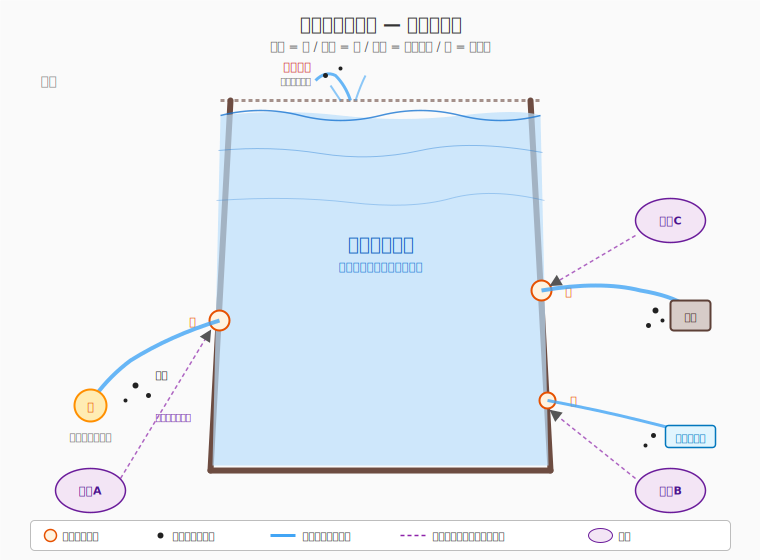

# 世界の法則

## はじめに

## 基本法則（公理）

### [A1] 現界と真界

- 人間が物理的に存在している3次元空間、宇宙全体を現界と呼ぶ
- 重力など物理法則は基本的に*著者が存在している世界*の物理法則に酷似している。
- 一方で特有の法則（マナ、精神エネルギー、魂）が存在し、この法則を利用して特定の現象を意図的に発生させることができる。（※後述）
  - その多くは現界における物理エネルギーを意図的に発生させることにより生ずるものだが、一部には現界の物理法則とは明らかに異なる現象もあり得る
  - 物理エネルギー
    - 力学的エネルギー（運動エネルギー）
    - 電磁気（電気・磁気）エネルギー
    - 熱エネルギー
    - 化学（結合・燃焼）エネルギー
    - 光・放射線エネルギー
    - 核（核分裂・核融合）エネルギー
- 現界とは異なる次元として真界が存在する。真界にはマナが存在する（[A2]参照）

### [A2] マナ — 真界の純粋エネルギー

- マナは現界の3次元空間とは異なる次元（真界）に存在する純粋なエネルギーである
  - 純粋なエネルギーはあらゆる物理エネルギーに変換可能な、ポテンシャルという概念そのもの
  - マナから物質の生成も可能である
- 現界から見ると3次元座標におけるエネルギーの軸としてみることもできる
- 真界の中でマナに濃淡がある
  - 真界は中でマナが揺れ動いている球体ととらえることができ、さらにその球体の表面が現界の3次元座標にマッピングされているイメージ
    - 球体の表面から手を伸ばして触れるマナが多ければ
    - 付近でマナが濃い状態であれば手を伸ばして触ることのできるマナの量も多い
    - 球体の奥まで手を伸ばせるかによって扱えるマナの量も変わる（魂の大きさによる。人のレベルで劇的に変わることはまずない）
  - マナの濃淡の変化に法則性はない
    - ただし3次元空間での時間軸で見たときに、その変化は非常に緩慢であり、数千年～数万年の単位で変化がわかる程度。（もちろん例外もある）
  - マナの総量は膨大であり、惑星単位での総エネルギーとはスケールが違う
    - 真界のマナの総量 》宇宙全体のエネルギー 》惑星単体のエネルギー
- マナをマナのままで取り出すことはできず、現界に現出した時点で何らかの物理エネルギーまたは物質に変換される
- 真界と現界は完全に隔絶しておらず、接点が存在する
  - この接点を通じて、マナが物理エネルギーや物質へ変換されて現界に現出することがある
  - 接点の具体的な形については[A3]個体・[A4]魂、変換のメカニズムは[A6]マナの変換を参照

### [A3] 個体

- 現界には、物質のまとまりのうち一定の境界と持続性を持つものが存在する。これを個体と呼ぶ
  - 境界とは、周囲と区別される「ひとまとまり」としての輪郭を意味する。厳密に物理的な境界面である必要はなく、ある視点からひとつの単位として認識されるまとまりであればよい
  - 持続性とは、その境界が一定の時間にわたって保たれることを意味する
- 個体は視点によって異なるスケールで認識される
  - ミクロでは細胞、ウイルス、結晶といった単位
  - 中間では動植物、人間、道具といった単位
  - マクロでは森林、山、惑星、銀河といった単位
- 個体は入れ子構造をとり、各レベルは独立した個体として扱われる
  - 例: 細胞 → 人間 → 地球 → 銀河
  - 入れ子の各レベルはそれぞれ独立した存在であり、上位の個体は下位の個体の単純な総和ではない
    - 地球という個体は、地球上の全生物・全物質の総和とは別に、地球そのものとして独立した個体性を持つ
- 個体はビッグバンに由来する
  - ビッグバン（[A6]参照）によって生まれた物質は、現界の精神エネルギーに保持されつつ入れ子構造の個体群を形成している
  - このため、現界に存在する個体は原則として真界との接点（[A4]魂）を固有の形で持つ

### [A4] 魂 — 真界と現界をつなぐ孔

- 真界と現界の接点は、個体固有の形で存在しており、これを魂と呼ぶ
- 魂は真界から現界にマナを橋渡しする孔であり、個体ごとに異なる形をもつ
- 形とは、そこを通ったマナに与えられる方向性という意味であり、現界に顕在する時の方向性がある程度決まる
  - その魂を持つ個体もその方向性に影響され、またその度合いに強弱がある
    - 例えば、「熱い」という方向性の魂をもった個体は、平熱が高いというような個性と言えるレベルのものから、身体の発熱能力にすぐれ極寒の中での活動が可能といった明らかに常人を超えるレベルまでありうる。
      - 後者のレベルが発現することは稀で、基本はその個体としての誤差（個性）レベルの影響である。
    - 例えば、ダイヤモンドは「固い」という方向性の魂を持った個体である。
      - ダイヤモンドだから「固い」という魂を持つのか、「固い」という魂を持つのでダイヤモンドなのか、両パターンがあり得る
- 3次元的な大きさの概念もあり、マナが一度に通ることができる量が決まる。
  - 奥行きが大きいほど、真界の奥からマナを引き出せる
  - 全体が大きいほど、1度に多くのマナを引き出せる
- 個体の成長の過程で変わる可能性はほとんどない
- 原則として個体と1対1で結びついている
  - つながるというのは精神エネルギーを伸ばしてアクセスできるようなイメージ
- 特殊な条件がそろうことで他個体の魂とつながることも可能（同調）
  - 同調とは、自分の精神エネルギーを伸ばして他個体の魂にアクセスすることであり、ラジオのチューニングに似ている。自分の精神エネルギーの波長を相手の魂の「周波数」に合わせることで接続が成立する
  - 同調が成立する条件:
    1. 精神エネルギーの波長が極めて近いこと — 波長が近いほど共鳴が起こりやすく、接続の精度が上がる。波長が離れている個体同士では、そもそも相手の魂を「感知」することすらできない
    2. 物理的距離が近いこと — 精神エネルギーは発生源から離れるほど減衰するため、同調には物理的な近接が必要となる。距離が離れるほど接続の維持が困難になる
  - 上記の条件を同時に満たす必要があり、難易度は非常に高い
  - 同調の成功例: 代行者・調停者は母体との波長が極めて近く、かつ母体の内部に存在するため物理的距離の条件も満たす。このため母体の魂と自由に同調できる
  - 同調の困難例: 異なる種族間では精神エネルギーの波長の傾向が大きく異なるため、仮に物理的に隣り合っていても同調は極めて困難である

### [A5] 精神エネルギー

- 思考や意思（意識的／無意識的にかかわらず）によって生み出されるエネルギー
  - 思考・意思を持つ個体が生み出す。個体によっては発生させないこともある（単純な結晶や微小な粒子など、知性をまったく持たない個体は精神エネルギーを発生させないか、発生させても極めて微弱）
  - 人だけではなく、動物のようなほかの生物や、地球といった惑星の単位でも、意思を持つ個体は精神エネルギーを発生させる
    - 例えばガイア論（地球そのものを一つの生命体とみなす仮説）のように、惑星規模の個体が固有の意思と精神エネルギーを持ちうると考える
- 入れ子構造の個体（例: 細胞→人間→地球、[A3]参照）のそれぞれが独立した精神エネルギーを持ちうる
  - 地球の精神エネルギーは、地球上の全生物の精神エネルギーの総和とは別に、地球固有のものとして独立して存在する
- マナと物理エネルギーの中間に位置する
- 精神エネルギーはマナと共鳴し、触媒として機能することで、真界からマナを現界の物理エネルギーや物質に変換して取り出すことができる（詳細は[A6]参照）
  - この際に経由する魂は原則として精神エネルギーを生み出す個体自身の魂であるが、ほかの個体の魂を経由することも不可能ではない（[同調](#a4-魂--真界と現界をつなぐ孔)）
- 精神エネルギーはマナ還元の触媒の役割も果たす
  - 意図して存在強度の高い物質やエネルギーに対しても瘴気との結合を促すことが可能
- 波長と強さと方向の3つの概念が存在する
- また、精神エネルギーはマナだけではなく、ほかの個体に影響を与えることもできる（[T7]参照）

#### 精神エネルギーの波長

- 精神エネルギーを生み出す個体によって個性があり、現界と真界の2極の間でグラデーションがある
  - このグラデーションを波長という
    - 3次元空間における波という意味ではなく、性質や相性という意味での波長に近い概念
  - 波長が同じである個体は原則として存在しない
- 個体が宇宙のルーツに近いほど、真界に近い波長の精神エネルギーを発生させる
  - 原初の宇宙誕生から時がたち、物質や生物として変化（進化）して形を変えていくことはルーツから遠ざかることであり、生み出す精神エネルギーの波長も真界から遠ざかること、すなわち現界寄りの波長となることである
    - 進化を繰り返した種であっても特異的にルーツが近い種族・個体が発生することもある（原初返り）
      - 種族に関係なく発生する
      - 人代においては1世代に2〜3人程度の頻度で発生する
      - 大多数は微弱な素養（常人より勘が鋭い程度）にとどまるが、強力な魔法を行使できる個体もまれに存在する
      - 発生原理は未解明（偶然発生する）
      - 原初返りの個体は精神エネルギーの波長が真界寄りであることが（秘匿組織内では）解明されているが、波長を人為的に真界寄りにする方法は未解明
      - 人工的に原初返りを試みる組織が存在し実験を繰り返しているが、再現性のある成功には至っていない
- 肉体の影響を強く受けるため、基本的に種族ごとに波長に傾向があり、また個体ごとの個性もある
- 精神エネルギーの波長が真界に近いほど、少しの精神エネルギーで多くのマナと共鳴できる

#### 精神エネルギーの強さ

- 意思の強さが精神エネルギーの強さに直接影響する
  - 意思を持っている、すなわち知性がある個体ほど大きな精神エネルギーを生み出す
- 個体の物理的な大きさも生み出す精神エネルギーに影響する
  - 人間程度の大きさ（重さ数十～100kg程度）の差であれば影響は小さい
- 精神エネルギーの強さは共鳴できるマナの量に影響する

#### 精神エネルギーの方向

- マナを現界に取り出したときにどのような物理エネルギーとして、または物質として顕在させるかは精神エネルギーの方向で決まる
- マナ還元の触媒とする際に、扱うことができる物理エネルギーまたは物質は精神エネルギーの方向で決まる
- 方向は精神エネルギーを作り出す個体自体が持っている方向性に強く引っ張られる
  - 訓練などによってある程度の矯正は可能
- 精神エネルギーの方向がシンプルなものほど、マナからの変換が容易である。
  - 例えば"熱する"いうのは物体に熱エネルギーを与えるだけであり、熱（エネルギー）という方向だけを持てばいいため非常にシンプル
  - 複数の物理エネルギーの組み合わせや、生体のような物質として複雑なものに影響を与えることは難易度が高い
- マナ還元の触媒とする際も同様で、シンプルなものほど扱いやすい
- 一方で人（知的生命体）であれば"そうしたい"という想いが乗るので、ある程度複雑な現象であっても発現の余地はある

#### 精神エネルギーが生み出される範囲

- 個体が自分自身と認識する範囲と、知覚できる（五感（六感）でとらえた）空間や物体
- 前者は容易であり無意識にも誰でも行っている
- 後者はセンス、または訓練が必要
  - 訓練で何とかなるのは、おおむね自分を中心とした半径1m程度

### [A6] マナの変換 — 現化とマナ還元

- マナは真界から現界へ現出する際に、必ず何らかの物理エネルギーまたは物質に変換される。これを現化と呼ぶ
  - 逆に、現界の物理エネルギーや物質がマナの状態に戻って真界へ還ることもある。これをマナ還元と呼ぶ（詳細は[T4]参照）
- マナの変換イメージ（桶のメタファー）
  - 真界を水で満たされた桶にたとえると、桶の中の水がマナ、水面の揺らぎがマナの濃淡にあたる
  - 桶の外側が現界であり、桶の壁に開いた蓋付きの穴が魂にあたる
  - 穴を通り抜けた水は、桶の外に出た瞬間には既に別の姿（物理エネルギーや物質）に変わっている——これが現化のイメージである
  - この変換に伴って副産物として瘴気（[T2]参照）が発生し、桶の上端からあふれ出る水が自然現化にあたる
- 現化（マナから現界の物理エネルギー・物質への変換）には2つの経路がある

#### 経路1: 魂を経由した現化（共鳴による現化）

- 精神エネルギーがマナと共鳴し、触媒として機能することで、真界から魂（[A4]）を経由してマナを現界の物理エネルギーや物質に変換して取り出すことができる
  - この共鳴が、マナを現界に取り出すための通常経路である
- 共鳴の効率は精神エネルギーの波長に依存する
  - 真界寄りの波長ほど、少量の精神エネルギーで大量のマナと共鳴できる
  - 現界寄りの波長では、共鳴効率が極めて低く、実質的にマナを操作できない
- 共鳴の効率は、魂の形と発現させたい現象の方向性の適合度にも依存する
- この経路が、魔法（[T5]）・魔術（[T6]）の基礎となる
- ビッグバンは、「現界」自体がその魂と精神エネルギーによってこの経路で引き起こした魔法である
  - この現化に伴って瘴気が発生するが、生成された物質は「現界」の精神エネルギーによって存在強度が保たれている
  - ただし瘴気によるマナ還元は緩やかに進行しており、宇宙はゆっくりとマナに戻っている

#### 経路2: 自然現化（媒介なしの現化）

- 対応する真界のマナが極端に濃くなった場合に、魂や精神エネルギーの媒介なしに自然に現化が起きることがある。これを自然現化と呼ぶ
- 自然現化は予測不能な自然災害的現象として発生する（火山噴火や異常気象の原因の一つ）
  - 大規模に発生する場合、マナの暴走と呼ばれる
- 発生した物質やエネルギーは精神エネルギーの裏付けがないため存在強度が極めて低く、すぐに瘴気と反応してマナに戻る
  - その過程で周囲の存在強度の低い物質を巻き込んでマナ還元してしまう危険がある

#### 変換の副産物

- 物理エネルギーまたは物質を現化した場合、副産物として瘴気が発生する
  - 生成した物理エネルギーまたは物質は瘴気と反応しやすい不安定な状態であり、生成時に発生した瘴気と反応してすぐにマナに戻ってしまうため、現界に長時間とどめておくのは難しい
  - 瘴気の詳細は[T2]瘴気を参照

#### マナ還元（逆方向の変換）

- マナ還元は、現界の物理エネルギーや物質が瘴気と結合してマナの状態に戻り、真界へ還る現象である
- 精神エネルギーを触媒として、意図的にマナ還元を引き起こすこともできる
- 詳細は[T4]マナ還元を参照

## 導出法則（定理）

### [T1] エネルギー保存則

- 導出元: [A1] 現界と真界 + [A2] マナ + [A6] マナの変換
- 真界と現界を含めた系全体でエネルギーは保存される
  - マナから物理エネルギーや物質を生成すると、その分だけ真界のマナが減少し、同量の瘴気が発生する
  - 瘴気がマナ還元を起こすと、物質・エネルギーと共にマナとして真界に戻る
  - すなわち「真界のマナ＋現界の物質・エネルギー＋現界の瘴気」の総量は常に一定である
- 現界単体で見た場合にも、瘴気の総量と現化したもの（マナから変換された物質・エネルギー）の総量は等しい
  - マナから何かを生成すれば必ず同量の瘴気が発生し、瘴気が結合すれば同量の物質・エネルギーが消滅する
  - この対称性により、現界内の「マナ由来の物質・エネルギー」と「瘴気」は常に1対1の関係にある
- 存在強度で保持されている物質・エネルギーについて
  - 精神エネルギーによって存在強度が保たれている物質は瘴気と反応しにくいが、対となる瘴気は消滅せずに残留する
  - 物質の存在強度が失われた場合、残留していた瘴気と反応してマナに還元される
  - ビッグバン由来の物質も同様であり、「現界」の精神エネルギーが保持し続ける限り安定するが、対となる瘴気は真界との境界付近に残留している

### [T2] 瘴気

- 導出元: [A6] マナの変換 + [T1] エネルギー保存則
- マナから物理エネルギーや物質を生成した際に発生する副産物で、現界に存在する物理エネルギーや物質と結合してマナに戻り、真界に収められる
  - 物理学における反物質と類似した概念であり、マナから生まれた物質と対消滅してマナに還元される
  - ただし物理学の反物質とは異なり、瘴気は即座に対消滅するのではなく、存在強度に応じて結合のしやすさが変わる
  - マナ還元と呼ぶ
- 何らかの原因で瘴気がたまることもあり得る
  - 瘴気は存在強度の弱い個体にとっては、体をむしばむ（結合して消滅する）毒となる

### [T3] 存在強度

- 導出元: [A5] 精神エネルギー + [A6] マナの変換 + [T2] 瘴気
- 物質・エネルギーが、精神エネルギーの影響を受けている度合いを表す
- マナと共振した物質・エネルギーは精神エネルギーが土台となっているため、精神エネルギーが強いほど存在強度は強くなる
- 精神エネルギーは特定の個体だけのものではなく、複数の個体の集合無意識のようなものも関係する
  - 例えば、万人から存在が知られる聖剣は存在強度が強い
  - 特定の個体が一時的にマナから変換した物質やエネルギーは、その個体の精神エネルギーがあったとしても上記と比べて弱い
- 存在強度が高い物質は瘴気と反応しにくい
- ビッグバン由来の物質は「現界」の精神エネルギーで保持されている
- 精神エネルギーで保持されている物質・エネルギーに対応する瘴気は、対となって残留する（物質が保持されている限り瘴気も還元されない）
- マナ由来のエネルギーが既存物質に物理的に作用した場合:
  - 物質自体はビッグバン由来の存在強度で保護されるため、瘴気によるマナ還元を受けない
  - 変化部分（温度上昇、構造変化など）には、術者の精神エネルギーに由来する存在強度が付与される
    - 術者の精神エネルギーが弱い場合、変化部分の存在強度が低く、瘴気が優先的に結合して変化が徐々に戻る
    - 術者の精神エネルギーが強い場合、変化部分の存在強度が高く、通常の物質と同等かそれ以上に安定する
  - 存在強度の決定要素:
    - 主要因: 術者の精神エネルギーの強さ（意思の力）
    - 副次的要因: 精神エネルギーの方向と魂の形の適合度
    - 影響しない: 精神エネルギーの波長（規模には影響するが安定性には中立）
    - 後天的要因: 時間経過と認知の蓄積により存在強度が上昇しうる（例: 名匠の作品が時代を経てさらに安定する）
  - 二次的な物理反応（例: マナ由来の熱で点火された化学反応）の結果は、物理法則に従い不可逆的に維持される

### [T4] マナ還元

- 導出元: [T2] 瘴気 + [T3] 存在強度
- 瘴気と物質または物理エネルギーが結合してマナの状態に戻ること
- マナの状態に戻るタイミングで真界に戻る
- 物質との結合しやすさがあり、存在強度で表すことができる
- 精神エネルギーを触媒にすることで存在強度にかかわらず、物質やエネルギーと瘴気を結合させることができる
- 瘴気は周囲の最も存在強度が低いものから優先的に結合する
  - 結合先がない場合（周囲が全て高存在強度の物質）は瘴気として残留する

### [T5] 魔法（現化・真化）

- 導出元: [A4] 魂 + [A5] 精神エネルギー + [A6] マナの変換
- 個体自身の精神エネルギーでマナまたは瘴気を操ることを魔法と呼ぶ。精神エネルギーの共鳴を直接利用するため効率が高いが、複雑な操作には不向き。
- 詳細は[魔法](魔法.md)を参照

### [T6] 魔術

- 導出元: [T5] 魔法 + 術式（精神エネルギーの波長シフト機構）
- 術式によって精神エネルギーを操作・変換し、マナを操ることを魔術と呼ぶ。術式が精神エネルギーの方向制御を代行するため、誰でも使えるが効率は魔法に劣る。
- 詳細は[魔術](魔術.md)を参照

### [T7] 超能力（感応・支配）

- 導出元: [A5] 精神エネルギーを他個体に作用
- 精神エネルギーでマナに共鳴するのではなく、ほかの個体そのものへ共鳴し、影響を与えることが可能。魔法・魔術には分類されない。
- 詳細は[超能力](超能力.md)を参照
