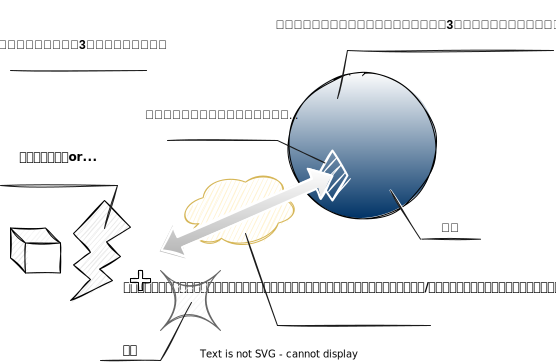

# 世界の法則

## はじめに

## 現界

- 人間が物理的に存在している3次元空間、宇宙全体を現界と呼ぶ
- 重力など物理法則は基本的に*著者が存在している世界*の物理法則に酷似している。
- 一方で特有の法則（マナ、精神エネルギー、魂）が存在し、この法則を利用して特定の現象を意図的に発生させることができる。（※後述）
  - その多くは現界における物理エネルギーを意図的に発生させることにより生ずるものだが、一部には現界の物理法則とは明らかに異なる現象もあり得る
  - 物理エネルギー
    - 力学的エネルギー（運動エネルギー）
    - 電磁気（電気・磁気）エネルギー
    - 熱エネルギー
    - 化学（結合・燃焼）エネルギー
    - 光・放射線エネルギー
    - 核（核分裂・核融合）エネルギー

## マナ（真界）

- マナは現界の3次元空間とは異なる次元（真界）に存在する純粋なエネルギーである
  - 純粋なエネルギーはあらゆる物理エネルギーに変換可能な、ポテンシャルという概念そのもの
- マナから物質の生成も可能である
- 物理エネルギーまたは物質を生成した場合に副産物として瘴気（※後述）が発生する
  - 生成した物理エネルギーまたは物質は瘴気と反応しやすい不安定な状態であり、生成時に発生した瘴気と反応してすぐにマナに戻ってしまうため、現界に長時間とどめておくのは難しい
- 現界から見ると3次元座標におけるエネルギーの軸としてみることもできる
- 真界の中でマナに濃淡がある
  - 真界は中でマナが揺れ動いている球体ととらえることができ、さらにその球体の表面が現界の3次元座標にマッピングされているイメージ
    - 球体の表面から手を伸ばして触れるマナが多ければ
    - 付近でマナが濃い状態であれば手を伸ばして触ることのできるマナの量も多い
    - 球体の奥まで手を伸ばせるかによって扱えるマナの量も変わる（魂の大きさによる。人のレベルで劇的に変わることはまずない）
  - マナの濃淡の変化に法則性はない
    - ただし3次元空間での時間軸で見たときに、その変化は非常に緩慢であり、数千年～数万年の単位で変化がわかる程度。（もちろん例外もある）
  - マナの総量は膨大であり、惑星単位での総エネルギーとはスケールが違う
    - 真界のマナの総量 》宇宙全体のエネルギー 》惑星単体のエネルギー
- 真界からマナを取り出すためには魂と精神エネルギーが関係する（※後述）
  - 真界 → 魂（真界と現界をつなぐ孔） → 精神エネルギー（触媒・共鳴） → 物理エネルギー
  - ビッグバンは「現界」自体がその魂と精神エネルギーによって引き起こした魔法である
    - 魔法であるため瘴気を伴い、生成された物質は「現界」の精神エネルギーによって存在強度が保たれている
    - ただし瘴気による還元は緩やかに進行しており、宇宙はゆっくりとマナに戻っている
  - マナが極端に濃くなった場合に、魂や精神エネルギーとは関係なく現界に染み出すこともある（マナの暴走）
    - 予測不能な自然災害的現象として発生する（火山噴火や異常気象の原因の一つ）
    - 発生した物質やエネルギーは精神エネルギーの裏付けがないため存在強度が極めて低く、すぐに瘴気と反応してマナに戻る
    - その過程で周囲の存在強度の低い物質を巻き込んでマナ還元してしまう危険がある
- マナをマナのままで取り出すことはできず、現界に取り出した時点で何らかの物理エネルギーまたは物質に変換される
  - 方向性を与えること、変換をコントロールすることが可能

### エネルギー保存則

- 真界と現界を含めた系全体でエネルギーは保存される
  - マナから物理エネルギーや物質を生成すると、その分だけ真界のマナが減少し、同量の瘴気が発生する
  - 瘴気がマナ還元を起こすと、物質・エネルギーと共にマナとして真界に戻る
  - すなわち「真界のマナ＋現界の物質・エネルギー＋現界の瘴気」の総量は常に一定である
- 現界単体で見た場合にも、瘴気の総量と現化したもの（マナから変換された物質・エネルギー）の総量は等しい
  - マナから何かを生成すれば必ず同量の瘴気が発生し、瘴気が結合すれば同量の物質・エネルギーが消滅する
  - この対称性により、現界内の「マナ由来の物質・エネルギー」と「瘴気」は常に1対1の関係にある
- 存在強度で保持されている物質・エネルギーについて
  - 精神エネルギーによって存在強度が保たれている物質は瘴気と反応しにくいが、対となる瘴気は消滅せずに残留する
  - 物質の存在強度が失われた場合、残留していた瘴気と反応してマナに還元される
  - ビッグバン由来の物質も同様であり、「現界」の精神エネルギーが保持し続ける限り安定するが、対となる瘴気は真界との境界付近に残留している

### 瘴気

- マナから物理エネルギーや物質を生成した際に発生する副産物で、現界に存在する物理エネルギーや物質と結合してマナに戻り、真界に収められる
  - 物理学における反物質と類似した概念であり、マナから生まれた物質と対消滅してマナに還元される
  - ただし物理学の反物質とは異なり、瘴気は即座に対消滅するのではなく、存在強度に応じて結合のしやすさが変わる
  - マナ還元と呼ぶ
- 何らかの原因で瘴気がたまることもあり得る
  - 瘴気は存在強度の弱い個体にとっては、体をむしばむ（結合して消滅する）毒となる

#### マナ還元

- 瘴気と物質または物理エネルギーが結合してマナの状態に戻ること
- マナの状態に戻るタイミングで真界に戻る
- 物質との結合しやすさがあり、存在強度で表すことができる
- 精神エネルギーを触媒にすることで存在強度にかかわらず、物質やエネルギーと瘴気を結合させることができる
- 瘴気は周囲の最も存在強度が低いものから優先的に結合する
  - 結合先がない場合（周囲が全て高存在強度の物質）は瘴気として残留する

#### 存在強度

- 物質・エネルギーが、精神エネルギーの影響を受けている度合いを表す
- マナと共振した物質・エネルギーは精神エネルギーが土台となっているため、精神エネルギーが強いほど存在強度は強くなる
- 精神エネルギーは特定の個体だけのものではなく、複数の個体の集合無意識のようなものも関係する
  - 例えば、万人から存在が知られる聖剣は存在強度が強い
  - 特定の個体が一時的にマナから変換した物質やエネルギーは、その個体の精神エネルギーがあったとしても上記と比べて弱い
- 存在強度が高い物質は瘴気と反応しにくい
- ビッグバン由来の物質は「現界」の精神エネルギーで保持されている
- 精神エネルギーで保持されている物質・エネルギーに対応する瘴気は、対となって残留する（物質が保持されている限り瘴気も還元されない）
- マナ由来のエネルギーが既存物質に物理的に作用した場合:
  - 物質自体はビッグバン由来の存在強度で保護されるため、瘴気によるマナ還元を受けない
  - 変化部分（温度上昇、構造変化など）には、術者の精神エネルギーに由来する存在強度が付与される
    - 術者の精神エネルギーが弱い場合、変化部分の存在強度が低く、瘴気が優先的に結合して変化が徐々に戻る
    - 術者の精神エネルギーが強い場合、変化部分の存在強度が高く、通常の物質と同等かそれ以上に安定する
  - 存在強度の決定要素:
    - 主要因: 術者の精神エネルギーの強さ（意思の力）
    - 副次的要因: 精神エネルギーの方向と魂の形の適合度
    - 影響しない: 精神エネルギーの波長（規模には影響するが安定性には中立）
    - 後天的要因: 時間経過と認知の蓄積により存在強度が上昇しうる（例: 名匠の作品が時代を経てさらに安定する）
  - 二次的な物理反応（例: マナ由来の熱で点火された化学反応）の結果は、物理法則に従い不可逆的に維持される

## 魂

- 真界から現界にマナの橋渡しをする孔は個体ごとに異なる形をもって存在しており、魂と呼ばれる。
- 形とは、そこを通ったマナに与えられる方向性という意味であり、現界に顕在する時の方向性がある程度決まる
  - その魂を持つ個体もその方向性に影響され、またその度合いに強弱がある
    - 例えば、「熱い」という方向性の魂をもった個体は、平熱が高いというような個性と言えるレベルのものから、身体の発熱能力にすぐれ極寒の中での活動が可能といった明らかに常人を超えるレベルまでありうる。
      - 後者のレベルが発現することは稀で、基本はその個体としての誤差（個性）レベルの影響である。
    - 例えば、ダイヤモンドは「固い」という方向性の魂を持った個体である。
      - ダイヤモンドだから「固い」という魂を持つのか、「固い」という魂を持つのでダイヤモンドなのか、両パターンがあり得る
- 3次元的な大きさの概念もあり、マナが一度に通ることができる量が決まる。
  - 奥行きが大きいほど、真界の奥からマナを引き出せる
  - 全体が大きいほど、1度に多くのマナを引き出せる
- 個体の成長の過程で変わる可能性はほとんどない
- 原則として個体と1対1で結びついている
  - つながるというのは精神エネルギーを伸ばしてアクセスできるようなイメージ
- 特殊な条件がそろうことで他個体の魂とつながることも可能（同調）
  - 同調とは、自分の精神エネルギーを伸ばして他個体の魂にアクセスすることであり、ラジオのチューニングに似ている。自分の精神エネルギーの波長を相手の魂の「周波数」に合わせることで接続が成立する
  - 同調が成立する条件:
    1. 精神エネルギーの波長が極めて近いこと — 波長が近いほど共鳴が起こりやすく、接続の精度が上がる。波長が離れている個体同士では、そもそも相手の魂を「感知」することすらできない
    2. 物理的距離が近いこと — 精神エネルギーは発生源から離れるほど減衰するため、同調には物理的な近接が必要となる。距離が離れるほど接続の維持が困難になる
  - 上記の条件を同時に満たす必要があり、難易度は非常に高い
  - 同調の成功例: 代行者・調停者は母体との波長が極めて近く、かつ母体の内部に存在するため物理的距離の条件も満たす。このため母体の魂と自由に同調できる
  - 同調の困難例: 異なる種族間では精神エネルギーの波長の傾向が大きく異なるため、仮に物理的に隣り合っていても同調は極めて困難である

## 精神エネルギー

- 思考や意思（意識的／無意識的にかかわらず）によって生み出される
  - 人だけではなく、動物のようなほかの生物や、地球といった惑星の単位でも、この世界に存在する質量をもった"個体"が生み出す
    - "個体"とは視点によって異なり、大小はあるがそれぞれが生み出す（ミクロでは人間の細胞、人間そのものという単位、マクロでは地球、銀河という単位）
- 入れ子構造の個体（例：細胞→人間→地球）のそれぞれが独立した精神エネルギーを持つ
  - 地球の精神エネルギーは、地球上の全生物の精神エネルギーの総和とは別に、地球固有のものとして独立して存在する
- マナと物理エネルギーの中間に位置する
- 精神エネルギーはマナと共鳴し、触媒の役割をすることで、真界から魂を経由してマナを現界の物理エネルギーに変換して取り出すことができる
  - この魂は原則として精神エネルギーを生み出す個体自身の魂であるが、ほかの個体の魂を経由することも不可能ではない（[同調](#魂)）
- 精神エネルギーはマナ還元の触媒の役割も果たす
  - 意図して存在強度の高い物質やエネルギーに対しても瘴気との結合を促すことが可能
- 波長と強さと方向の3つの概念が存在する
- また、精神エネルギーはマナだけではなく、ほかの個体に影響を与えることもできる（感応・支配）

### 精神エネルギーの波長

- 精神エネルギーを生み出す"個体"によって個性があり、現界と真界の2極の間でグラデーションがある
  - このグラデーションを波長という
    - 3次元空間における波という意味ではなく、性質や相性という意味での波長に近い概念
  - 波長が同じである個体は原則として存在しない
- 個体が宇宙のルーツに近いほど、真界に近い波長の精神エネルギーを発生させる
  - 原初の宇宙誕生から時がたち、物質や生物として変化（進化）して形を変えていくことはルーツから遠ざかることであり、生み出す精神エネルギーの波長も真界から遠ざかること、すなわち現界寄りの波長となることである
    - 進化を繰り返した種であっても特異的にルーツが近い種族・個体が発生することもある（原初返り）
      - 種族に関係なく発生する
      - 人代においては1世代に2〜3人程度の頻度で発生する
      - 大多数は微弱な素養（常人より勘が鋭い程度）にとどまるが、強力な魔法を行使できる個体もまれに存在する
      - 発生原理は未解明（偶然発生する）
      - 原初返りの個体は精神エネルギーの波長が真界寄りであることが（秘匿組織内では）解明されているが、波長を人為的に真界寄りにする方法は未解明
      - 人工的に原初返りを試みる組織が存在し実験を繰り返しているが、再現性のある成功には至っていない
- 肉体の影響を強く受けるため、基本的に種族ごとに波長に傾向があり、また個体ごとの個性もある
- 精神エネルギーの波長が真界に近いほど、少しの精神エネルギーで多くのマナと共鳴できる

### 精神エネルギーの強さ

- 意思の強さが精神エネルギーの強さに直接影響する
  - 意思を持っている、すなわち知性がある個体ほど大きな精神エネルギーを生み出す
- 個体の物理的な大きさも生み出す精神エネルギーに影響する
  - 人間程度の大きさ（重さ数十～100kg程度）の差であれば影響は小さい
- 精神エネルギーの強さは共鳴できるマナの量に影響する

### 精神エネルギーの方向

- マナを現界に取り出したときにどのような物理エネルギーとして、または物質として顕在させるかは精神エネルギーの方向で決まる
- マナ還元の触媒とする際に、扱うことができる物理エネルギーまたは物質は精神エネルギーの方向で決まる
- 方向は精神エネルギーを作り出す個体自体が持っている方向性に強く引っ張られる
  - 訓練などによってある程度の矯正は可能
- 精神エネルギーの方向がシンプルなものほど、マナからの変換が容易である。
  - 例えば"熱する"いうのは物体に熱エネルギーを与えるだけであり、熱（エネルギー）という方向だけを持てばいいため非常にシンプル
  - 複数の物理エネルギーの組み合わせや、生体のような物質として複雑なものに影響を与えることは難易度が高い
- マナ還元の触媒とする際も同様で、シンプルなものほど扱いやすい
- 一方で人（知的生命体）であれば"そうしたい"という想いが乗るので、ある程度複雑な現象であっても発現の余地はある

### 精神エネルギーが生み出される範囲

- 個体が自分自身と認識する範囲と、知覚できる（五感（六感）でとらえた）空間や物体
- 前者は容易であり無意識にも誰でも行っている
- 後者はセンス、または訓練が必要
  - 訓練で何とかなるのは、おおむね自分を中心とした半径1m程度

### 感応・支配

- 精神エネルギーでマナに共鳴するのではなく、ほかの個体そのものへ共鳴し、影響を与えることが可能
- 魔法・魔術には分類されない超常的な能力
- 詳細は[超能力](超能力.md)を参照

## 遺物

- 神代・古代に存在した個体・道具・構造物のうち、その時代の精神エネルギーの痕跡を残して現存するもの
- 存在強度が極めて高いため、長い年月を経ても瘴気によるマナ還元に抵抗し、現界に残り続けている
  - 代行者・調停者が母体の魂を用いて作り出したもの（母体由来の存在強度）
  - 多くの個体に認知・使用されたことで集合無意識の裏付けを持つもの
  - 強い精神エネルギーが封入されたもの
- 遺物は道具に限らない
  - 構造物（神殿、要塞、儀式場など）
  - 空間そのもの（強い精神エネルギーが空間に刻まれたもの）
  - 残留する精神エネルギーの痕跡
- 遺物のうち術式が刻まれた道具で、道具自体が精神エネルギーを発生させるものは「伝説の武具・道具」として分類される
  - 詳細は[伝説の武具・道具](artifacts.md)を参照
- 遺物の周辺では魔法環境が変質する傾向がある
  - 遺物に残る精神エネルギーが真界のマナとの共鳴を持続しており、周辺の魔法環境に影響を与える
  - この影響はダンジョン化の原因の一つとなる（詳細は[ダンジョン](dungeon.md)を参照）

### 種子

- 代行者・調停者が、自身の全滅を予見して残した「次世代の個体を発芽させるための遺物」
  - 代行者・調停者の精神エネルギーの痕跡と、母体（地球やエオス）の魂の方向性が封じ込められている
  - 特定の環境条件が満たされたときに発芽し、新たな個体・種族を生む
- 種子から発芽した個体は代行者・調停者の末裔としての性質を持つ
  - 母体の魂の方向性を引き継ぐ
  - 精神エネルギーの波長が代行者に近い傾向がある
- 発芽条件
  - 周辺の環境変化（対応する真界のマナの濃淡の変動、気候、生態系の変化など）
  - 地球自身の意思による促進も影響する
- 発芽した個体がテリトリーを構築し、集落を形成することがある
  - このテリトリーがダンジョン化するケースがある（詳細は[ダンジョン](dungeon.md#b-種子由来)を参照）
- 古代にはベローナの代行者の活動による環境変化と地球の意図的促進により、複数の種子が同時に発芽した（[年表](../history/timeline.md)参照）
  - エルフもエオスの代行者・調停者が残した種子から発芽した種族である
    - エオスの魂の方向性「成長・繁茂」が種子に封じ込められており、発芽した個体がこの方向性を引き継いでいる
- 古代において、ベローナの代行者の活動による環境変化と地球の意思による意図的促進により、神代に残された種子はすべて発芽済みである
  - 発芽条件が自然に整わなかった種子も、地球の意思により強制的に発芽させられた
  - 環境に適応できなかった個体・種族はそのまま滅亡した
  - 原則として、人代において新たな種子の発芽が起きることはない（ただし未知の特殊な事情による例外の可能性は排除しない）
